# General

First of all, this material is related to **my personal studies** of [this bootcamp](https://www.googleadservices.com/pagead/aclk?sa=L&ai=DChcSEwj86amcg-SKAxU1kO4BHbIPN5AYABAAGgJkeg&ae=2&aspm=1&co=1&ase=2&gclid=Cj0KCQiAvvO7BhC-ARIsAGFyToW3p41_9ygY24uxgC2hnUoLaYhdKHe3S6doZJcGm-OZsydJ8PCGS4IaAgvFEALw_wcB&ohost=www.google.com&cid=CAESVeD2E80a1M2CDTlusoXXXt9p6_vHqv-TwY7XGzxypvH9IT4PWUp4yt9VPL2qeDYwMgDKKe2kK_X_3a1Gjz9-WJTiADRDUJSuEZX0FBZyD83PnHCPw-8&sig=AOD64_1g8HATRzeM824qM0M4bIqNjWclXQ&q&nis=4&adurl&ved=2ahUKEwin1qCcg-SKAxX9G7kGHdwoBekQ0Qx6BAgQEAE) on DIO platform. This material is **NOT** free to reproduce. I ask you to please access the DIO course. Here I only put **my** notes.


We can have one **app service** for several **web apps**. Is like to have one web server for several web apps.


# Instalation of AZ CLI

I followed [these instructions](https://learn.microsoft.com/pt-br/cli/azure/install-azure-cli-linux?pivots=apt) to install AZ CLI


# Login in

I executed:

```
az login
```

Then a browser window was open. I logged in. But the authentication was failed. The passed reason was due to MFA.

To solve, in the same previous browser window, I logged (and confirmed with the code that was sent to my email). Then it was necessary to execute `az login` again and then in the next attemp the authentication through browser window (opened with the command `az login`) was successfull.


# Cloning a simple website Github repository

I executed these command:

```
mkdir webapp01
cd webapp01
git clone git@github.com:Azure-Samples/html-docs-hello-world.git
```

With these commands I created the directoty structure **webapp01 -> html-docs-hello-world -> website files (css, js, img ...)**


# Seeing my resource groups

I executed this command:

```
az group list --query "[].{id:name}" 
```


# Creating the app

Please execute this command:

```
 az webapp up -g DefaultResourceGroup-EUS -n apphtml01x --html --region us-east-01
```

An **empty** app will be created.

This command didn't work due a limitation related to a resource group or a region. I saw correctly the resource groups available with the previous command, ok?

I tried also to create a resource group in [Azure portal](http://portal.azure.com), but this attempt didn't work too.


# Uploading the app

Please execute the previous command again.


# Updating the app

After making a change in the HTML as exampĺe, teacher executed again the previous command.


# Getting the URL of the app

The URL was showed in the output of the command to upload or update the app:


# Versioning the app

I versioned the Azure app passed by the teacher without the original .git diretory to avoid problems on vesioning. But is the same of the git repository that I cloned before (as documented in this document).


# Configuring an app

You can configure several things of an app in the Azure Portal:


You configure there several things, ce3retificates as exampĺe.

If you wanna using websockets, you have a specific configuration about this thing.


# General observations

Teacher said that is common paths generating problems. Paths related to paths of the files.

You have also an option in the Azure Portal (inside the app details) to see the logs of the app. You have to enable logs in the app to see the logs.

In the next image you can see a change in the consumption of some resource related to the app:


Teacher said that the log retention time is 30 days and if you try to extend this period, this action involves costs.

You have several configurations and options to be done om the Azure Portal. Like

- Load test;
- See metrics;
- An area to configure blocks;
- An area to see quotes;
- An area to see application insigths.


# Seeing the logs

You can see the logs in the area related to the app in the Azure Portal an also in the CLI with this command:

```
az webapp log tail --name <name_of_the_app> --resource-group <name_of_the_resource_group> --level verbose
```


# Configuring a certificate

By default the app running in the default subdomain of the domain **azurewebsite.net** already have a certificate, but if you change the domain you can configure a certificate for this new domain in this area:


Teacher said that is sufficient to only configure the certificate in the area related to the previous image. You can also put the certificate in a keyvault and configure it. On adding a certificate you have an option to import a certificate from a keyvault.

Teacher said that the certificate **.cert** you can import directly and the certificate **.pfx** you have to put it in a keyvault.


# Dimensioning

You can make available more instances of the app based on a specific date like black friday or some resources, like measuring the CPU consumption and making new instances available on hitting 80% of the CPU consumption.


# Scaling

Also in Azure Portal you can configure horizontal and vertical scaling:


Related to scale horizontal and vertical, the options in the portal are:


Is cool to access the Azure Portal, access the area related to the app and see all the options.

In the time teacher recorded the course, the screen to configure autoscaling was:


More autoscaling settings:


Teacher said that general things can be observed every 5 minutes, but to memory his advice is to observe on each 3 minutes.

And you also can configure the scaling to be based on a specific date.

Is important to configure a name of the rule that have sense because this name will appear in the report when the rule is triggered.

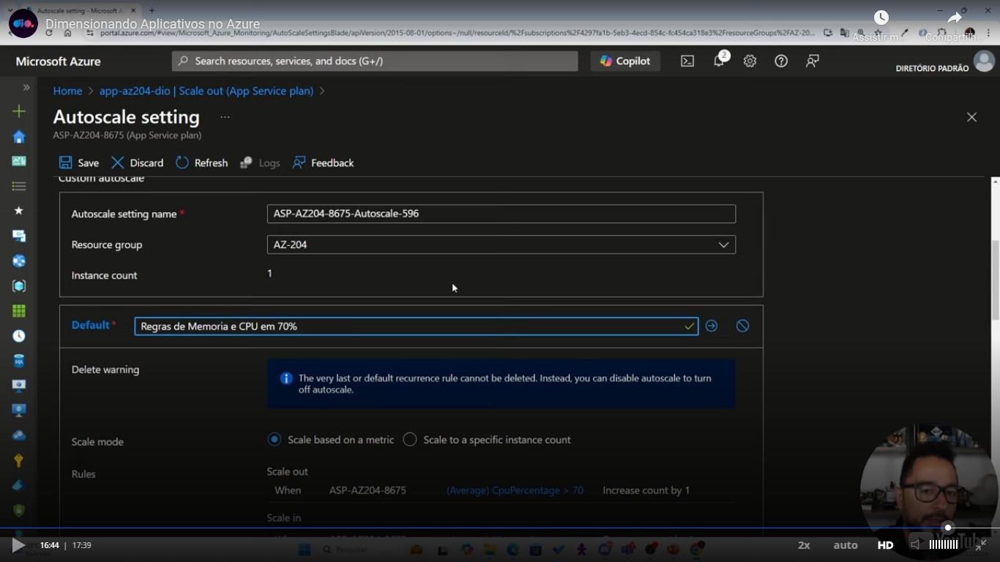


# Slots

with slots you can have different versions of your web app and you can switch between them. You can also select a portion of the traffic to be redirected to one slot and another part to be redirected to another slot.

Teacher said that slots is well applied to canary releases, where you wanna to limit the new version of the app to a small percent of the users, to rollback an implantation and to blue/green deployments.

You can't work with slots in the basic layer.

You can have a specific domain for every slot and this domain can point to a specific environment, like production.

If you have different domains to every slot, you can have a specific certificate for every slot.

About the slot changes:

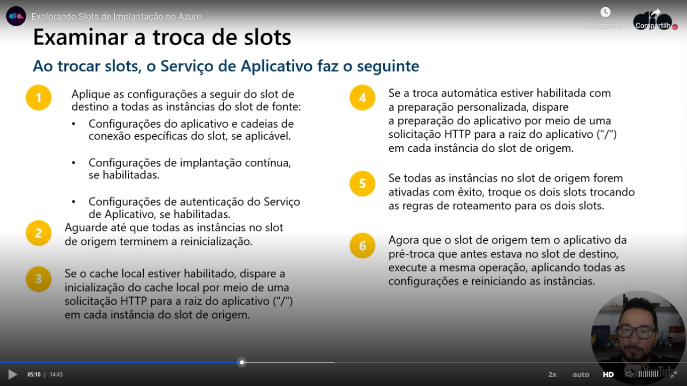

When you configure a slot, you can configure a percent of the traffic that be redirected to this slot. 

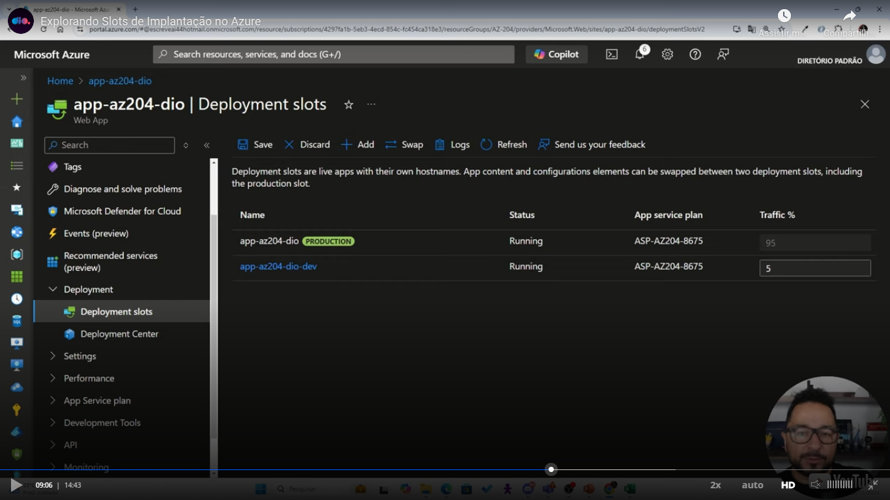

Teacher said that is a good pratice to configure the cookie **x-ms-routing-name** pointing to the environment related to a specific slot.

Teacher changed the slot related to the production easily with a click on a button "swap":

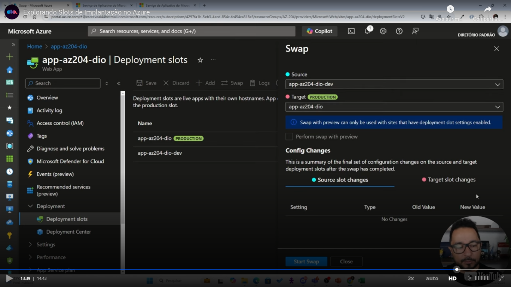

This occurred with no downtime.

Teacher also made tests with a GET parameter http://domain/?**x-ms-routing-name=self**


# Hands on

First teacher created a resource group to put all the resources in this group.

After he created a storage account. The storage account configuration have some fields related to a storage, using the words "files" (Azure files) and "blob".

After in the next screen he get the storage account name:

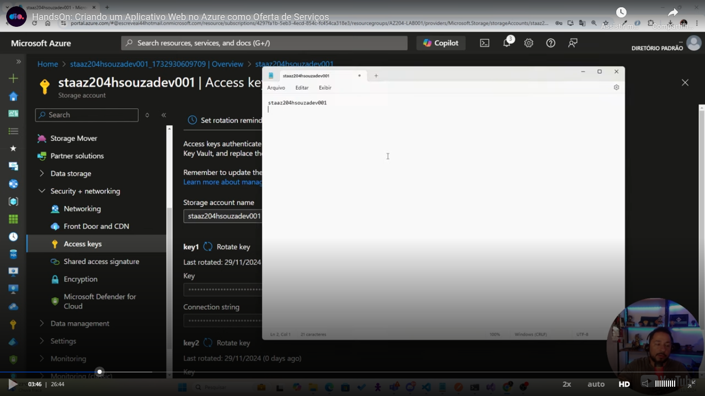

After, in the same screen, he got the connection string and the key.

Next, he created a blob container in the area of storage browser:

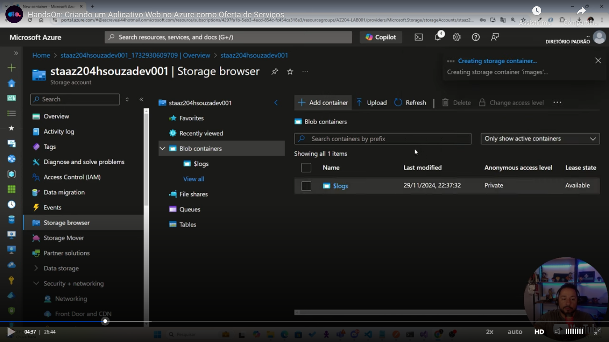

Them he uploaded some images

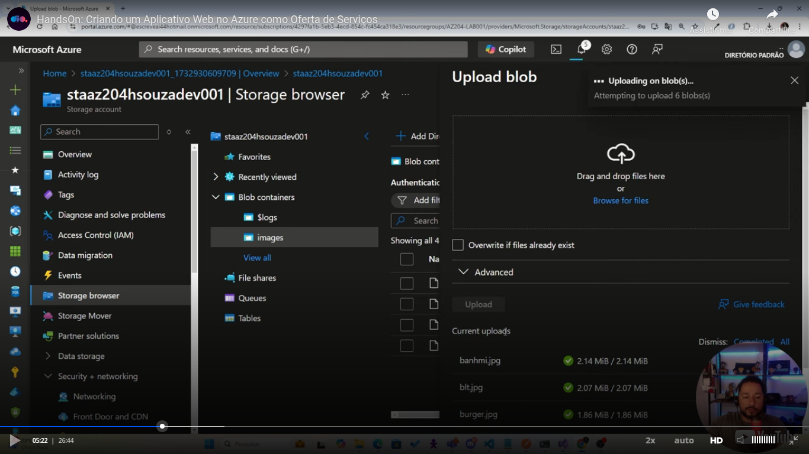

He can got an address to access one of the images, but when he tried to access this address through the browser, he got an access denied error:

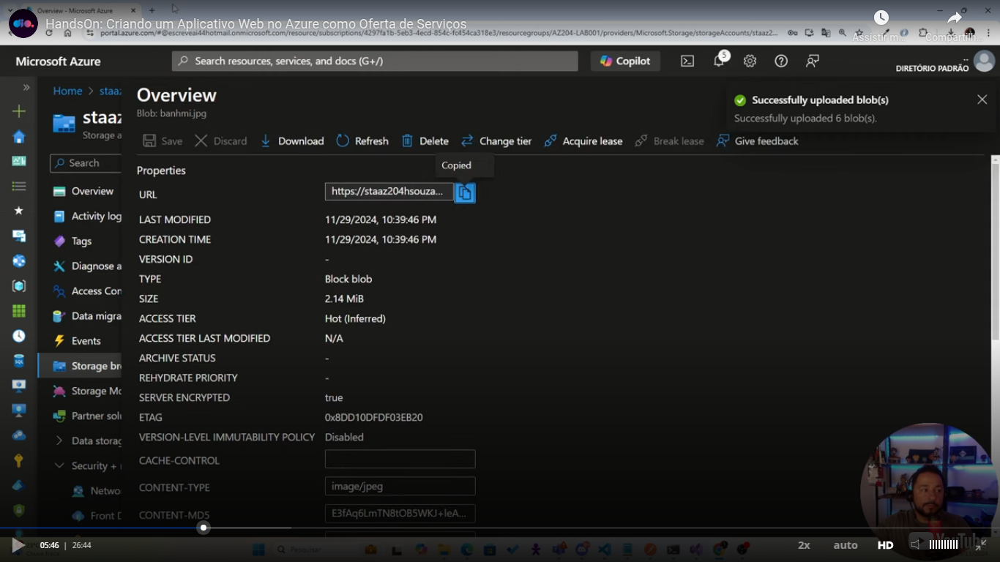

Then in the page that listing the Azure services (home of Azure Portal) he clicked in "AZ204-LAB001" then he created a web app:

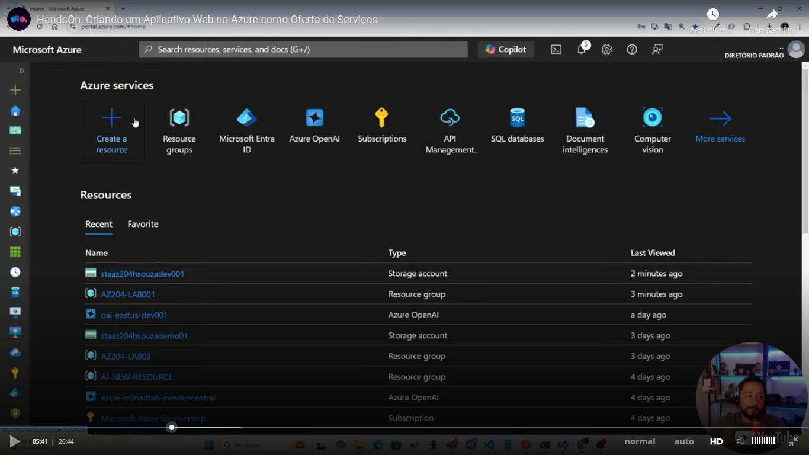

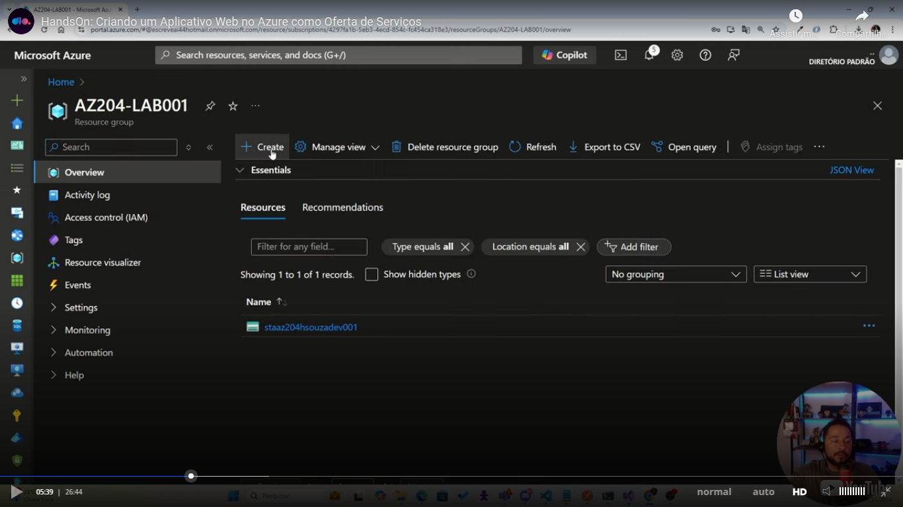

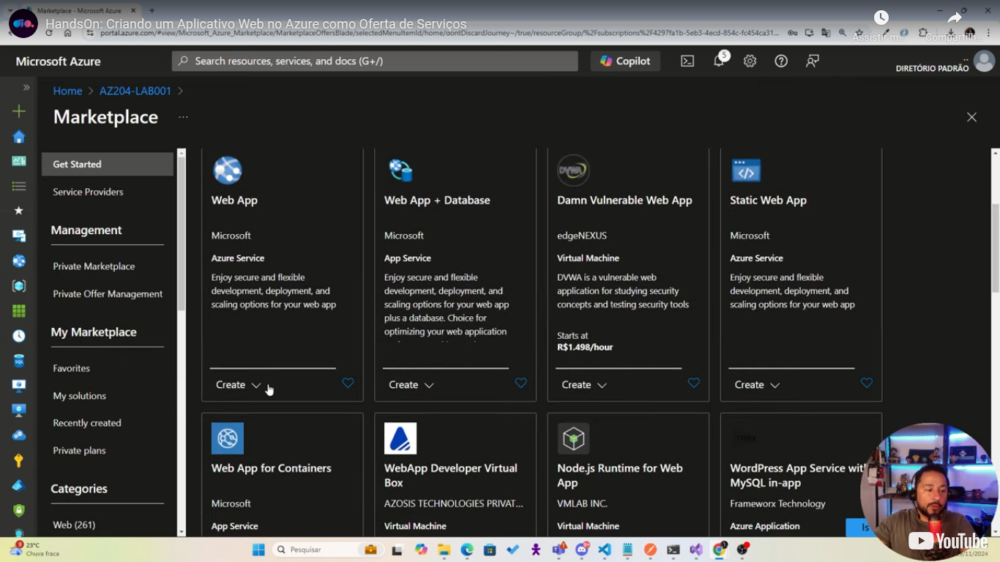

Teacher said that when you create a web app, a app service plan is also created.

In the next screens he selected:

- **Stack**: .NET 8;
- He setected **Canada central** as the **region**;
- Next he said: "pode ser Windows";
- Then he said "não quero database" (refering to the information of database showed in the next screen);
- He said in the second step "deploy vamos fazer na mão";
- In the other configurations he left the default values.1

Then he opened VSCode and there he opened a local address allfiles\labs\01\starter\ . He ask us to open the 3 folders inside this path. When talking about the structure he tall us that there already have one build of the "Api" and one build of the "Web" (see the folders in the next image). Also, the images that he uploaded to the Azure wer there also.

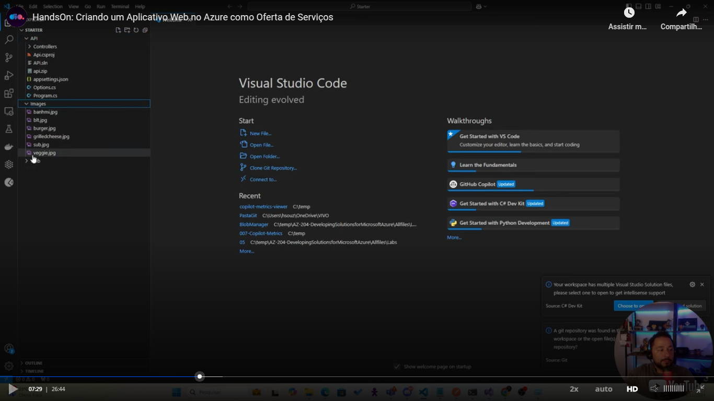

Then in a terrminal inside VSCode he executed:

```
az login
```

And logged in.

Then to see the web apps created in Azure he executed:

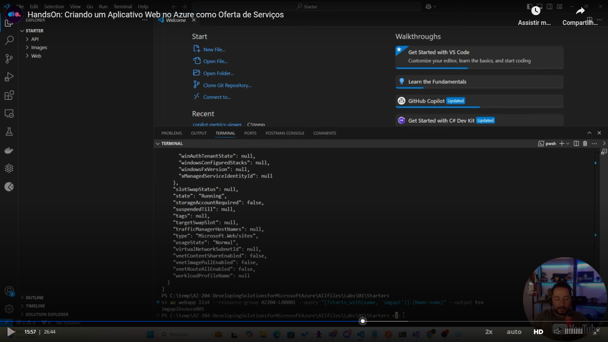


# Slides of the class

[You can access here](slides-of-the-class.pptx)

Again, the material here is **not** free to be copied and the presentation is a DIO presentation, please talk to them and not to me if you want to use the presentation.