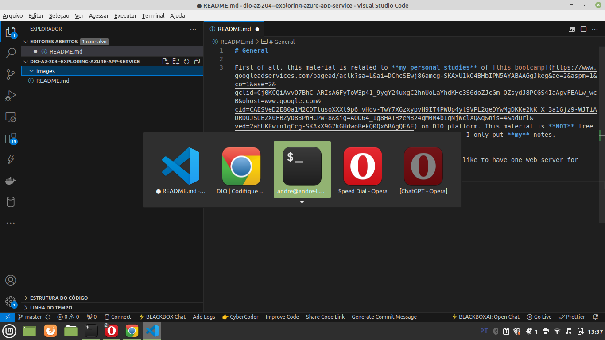
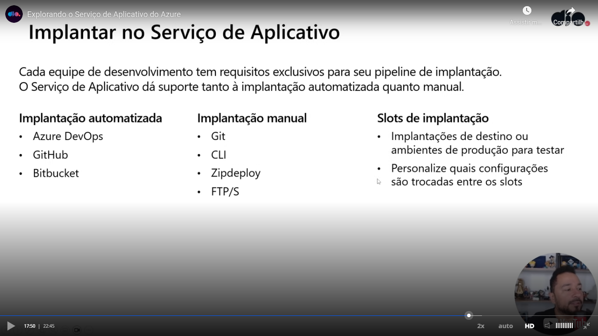
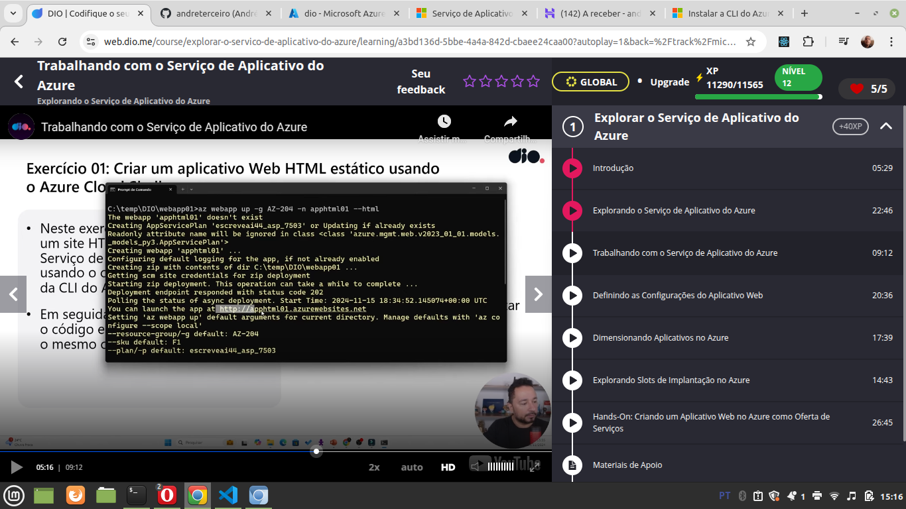

# General

First of all, this material is related to **my personal studies** of [this bootcamp](https://www.googleadservices.com/pagead/aclk?sa=L&ai=DChcSEwj86amcg-SKAxU1kO4BHbIPN5AYABAAGgJkeg&ae=2&aspm=1&co=1&ase=2&gclid=Cj0KCQiAvvO7BhC-ARIsAGFyToW3p41_9ygY24uxgC2hnUoLaYhdKHe3S6doZJcGm-OZsydJ8PCGS4IaAgvFEALw_wcB&ohost=www.google.com&cid=CAESVeD2E80a1M2CDTlusoXXXt9p6_vHqv-TwY7XGzxypvH9IT4PWUp4yt9VPL2qeDYwMgDKKe2kK_X_3a1Gjz9-WJTiADRDUJSuEZX0FBZyD83PnHCPw-8&sig=AOD64_1g8HATRzeM824qM0M4bIqNjWclXQ&q&nis=4&adurl&ved=2ahUKEwin1qCcg-SKAxX9G7kGHdwoBekQ0Qx6BAgQEAE) on DIO platform. This material is **NOT** free to reproduce. I ask you to please access the DIO course. Here I only put **my** notes.


We can have one **app service** for several **web apps**. Is like to have one web server for several web apps.






# Instalation of AZ CLI

I followed [these instructions](https://learn.microsoft.com/pt-br/cli/azure/install-azure-cli-linux?pivots=apt) to install AZ CLI


# Login in

I executed:

```
az login
```

Then a browser window was open. I logged in. But the authentication was failed. The passed reason was due to MFA.

To solve, in the same previous browser window, I logged (and confirmed with the code that was sent to my email). Then it was necessary to execute `az login` again and then in the next attemp the authentication through browser window (opened with the command `az login`) was successfull.


# Cloning a simple website Github repository

I executed these command:

```
mkdir webapp01
cd webapp01
git clone git@github.com:Azure-Samples/html-docs-hello-world.git
```

With these commands I created the directoty structure **webapp01 -> html-docs-hello-world -> website files (css, js, img ...)**


# Seeing my resource groups

I executed this command:

```
az group list --query "[].{id:name}" 
```


# Uploading the app

This command didn't work due a limitation related to a resource group or a region. I saw correctly the resource groups available with the previous command, ok?

```
 az webapp up -g DefaultResourceGroup-EUS -n apphtml01x --html --region us-east-01
```
I tried also to create a resource group in [Azure portal](http://portal.azure.com), but this attempt didn't work too.


# Updating the app

After making a change in the HTML as exampĺe, teacher executed again the previous command.


# Getting the URL of the app

The URL was showed in the output of the command to upload or update the app:




# Versioning the app

I versioned the Azure app passed by the teacher without the original .git diretory to avoid problems on vesioning. But is the same of the git repository that I cloned before (as documented in this document).